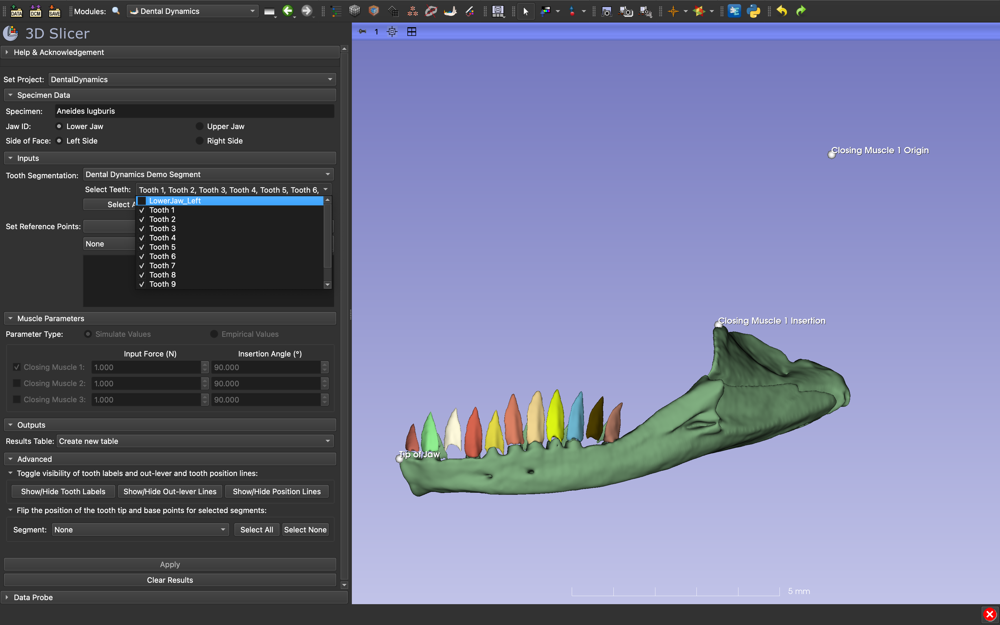
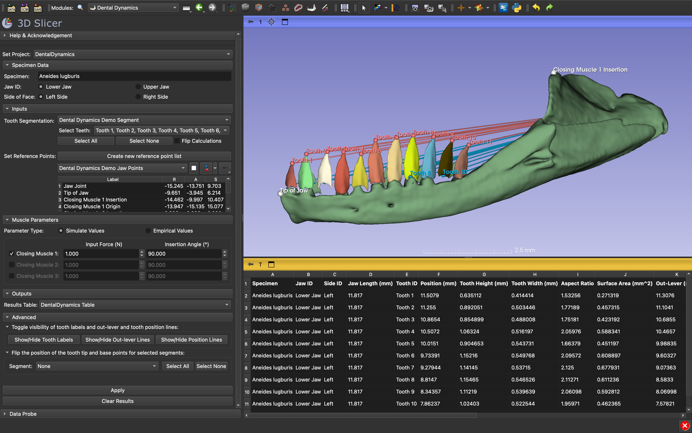

# DentalDynamics Tutorial

The `Dental Dynamics` module is used to model vertebrate jaw function and calculate several key jaw and tooth traits. 
The module requires a segmentation file containing individually segmented teeth and user-defined anatomical landmarks (jaw joint, tip of the jaw, and the insertion and origin site of up to three jaw closing muscles). 
These inputs are used to automatically calculate jaw length and muscle in-levers, and for each tooth its position along the jaw, height, width, aspect ratio, surface area, mechanical advantage, output force, and tooth stress. 
`Dental Dynamics` can also take additional user inputs to estimate muscle parameters such as input force and insertion angle to provide more informed estimates of bite force.

To use `Dental Dynamics`, first go to the `Sample Data` module and download the **Demo Skull**, **Demo Segment**, and the **Demo Jaw Points**. In this example, we will being using data from a CT scan of the arboreal 
salamander (*Aneides lugubris*), originally obtained from MorphoSource.

Then find `Dental Dynamics` module under the SlicerBiomech module menu folder and:

1. Start by entering in the **Specimen Data**. In this case, we will be analyzing the lower left jaw of *Aneides lugubris*

2. Then select **Dental Dynamics Demo Segment** as the **Tooth Segmentation**. The **Dental Dynamics Demo Segment** may have already been selected by default.

3. **Select Teeth** to perform computations on. Here we will unselect the "LowerJaw_left" segment. You may use the **Select All** or **Select None** buttons to quickly select or deselect segments.

4. Under **Set Reference Points** select the **Dental Dynamics Demo Jaw Points**. If you are using your own data for the first time, click the **Create new reference point list** to create a blank point list.

5. The *Jaw Joint*, *Tip of Jaw*, *Closing Muscle 1 Insertion*, and *Closing Muscle 1 Origin* points are all predefined in the sample data. Clicking the label name of undefined points will activate point placement mode. To clear unwanted points, enter the position as 0,0,0 or right-click the point in the 3D view and select **Clear control point position**.

6. Change the **Input Force** and **Insertion Angle** to simulate bite force with. Retaining the default values (1 and 90, respectively) will ensure tooth force calculations reflect variation in mechanical advantage. 

7. If more detailed information about muscles is known and the origin of at least one closing muscle is defined, select **Empirical Values** as the **Parameter Type** to use a different set of inputs. Only values for the selected **Parameter Type** will be used during calculations.

8. The option to add additional closing muscles and change their parameter values will remain disabled (greyed out) until the insertion point (Simulate) or the insertion and origin points (Empirical) have been defined for that muscle.

9. If no **Results Table** has been selected, a new one will be created by default.

10. Click the **Apply** button to perform calculations. Upon completion of the analysis, a results table should have populated the scene and points should have been placed at the tip (red) and base (blue) of each selected tooth. 

11. Visually inspect the points to ensure that `Dental Dynamics` has correctly identified the tip and base of each tooth. Use **Show/Hide Out-lever lines** and **Show/Hide Position lines** to draw lines from the jaw joint to the tip and base of each tooth, respectively. If there is a mistake, see the Troubleshooting steps.

12. Export results by switching to the `Data` module, right-clicking the results table an export as a .csv file. Alternatively, copy cells from the table and paste directly into a spreadsheet.

13. To analyze a new jaw, navigate to **Set Project** at the top of `Dental Dynamics` and Create a new ScriptedModule. Creating new projects for each jaw is recommended when using different reference points and parameters for each jaw.
 

## Troubleshooting

Let's say `Dental Dynamics` has incorrectly identified the position of the tooth tip and base for some or all of the teeth on the jaw. If the points are slightly off, they can be manually adjusted and the results table will be updated by clicking the **Apply** button. 
If the tip and base of some teeth are swapped entirely, use the **Show/Hide Tooth Labels** button to identify which teeth need the tip and base points flipped, and use the **Segment** selector to select which teeth are incorrect and click *Apply* again. If the tip and base points are flipped for all of the teeth, use the **Clear Results** button, select the **Flip Calculations** check box, and click **Apply**.

